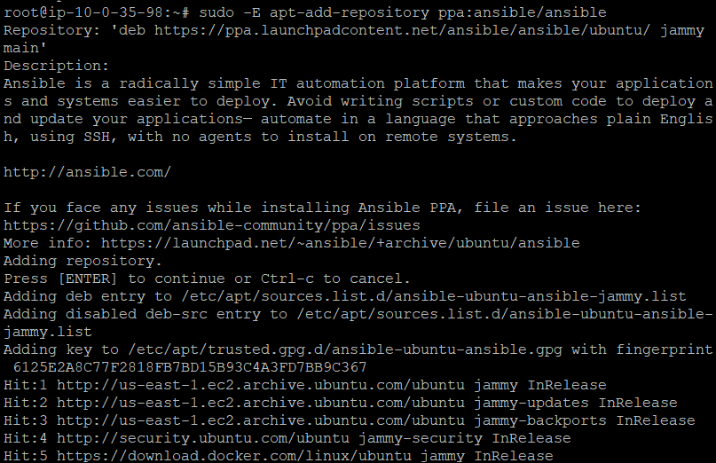

# 1. ERROR: ppa ' ansible/ansible' not found (use --login if private)

*When running the command "sudo apt-add-repository ppa: ansible/ansible"* 

 

*solution: sudo -E apt-add-repository ppa:ansible/ansible   "use -E flag"* 

 

