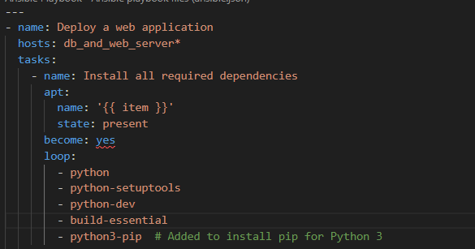
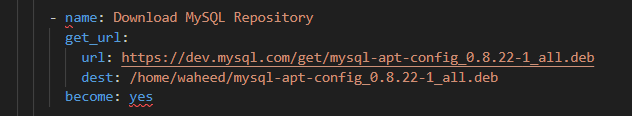
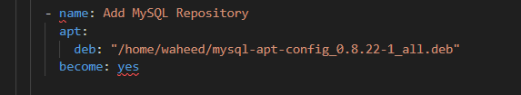
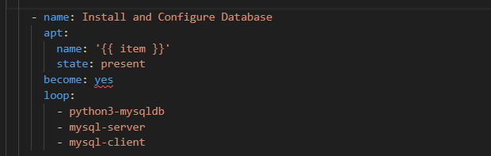
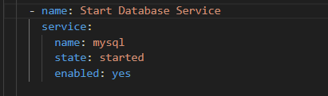
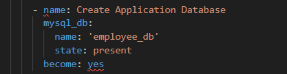
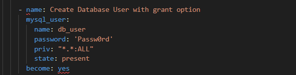
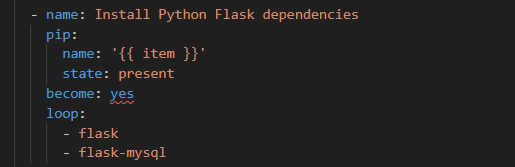
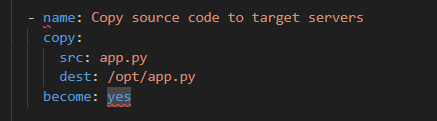
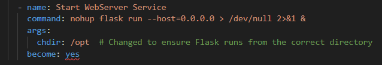

# Deployment of sample application using flask webserver and MySql database

### configuration of worker nodes is present in the playbook-introduction section

*1. we are creating a small application using MySQL , Flask , Python. In the first module we are using “apt” module where we are installing Dependent packages for our application.* 

*2. Here, we have used loop condition . Since, we have many packages to install like python ,pip , python-setuptools and more….we are using loop to iterate among the list . The {{ item }} is Jinja2 templating format which we are using in ansible to work as a dynamic variable where values changes.* 

*3. In the second module we are using “get_url” module to download a .deb file from MySQL repository to install MySQL and “url” is the link where MySQL is present in repository and “dest” is where you want to install it in target servers. We have used “become”: yes because we wanted to execute the task with root privileges.* 

*4. In the third module we are using apt module with deb which is help to execute that .deb file.* 

*5. In the fourth module we are using apt module for Installing more packages for MySQL client and server.* 

*6. In the fifth module we are using service module to start the MySQL database service.* 

*7. In the sixth module we are using mysql_db module to create an application database “employee_db” and login_unix_socket is the path to a Unix domain socket for local connections.* 

*8. In the seventh module we are using mysql_user module where we are creating a user “db_user” with password as “Passw0rd” with all database privileges.* 

*9. In the eighth module we are using pip module to install packages of python flask dependencies.* 

*10. In the nineth module we are using copy module to copy the app.py file from source machine to target machine “/opt/app.py” path.* 

*11. In the tenth module we are using shell module to run the flask application in target machines.* 

