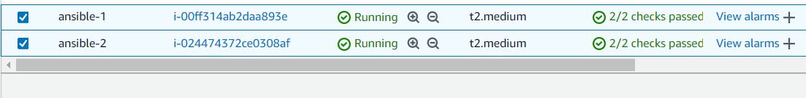
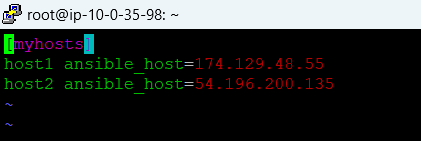
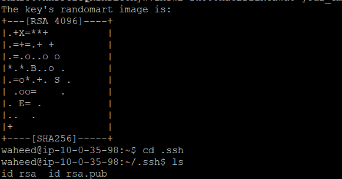
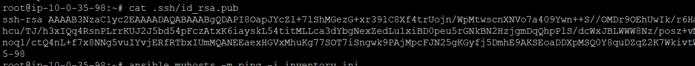
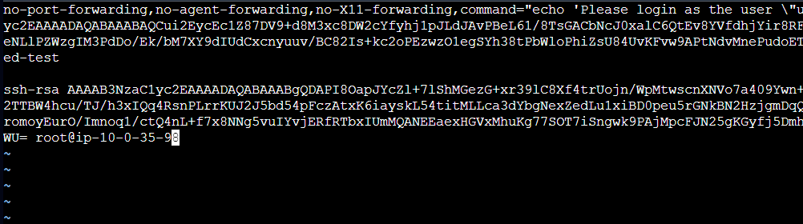
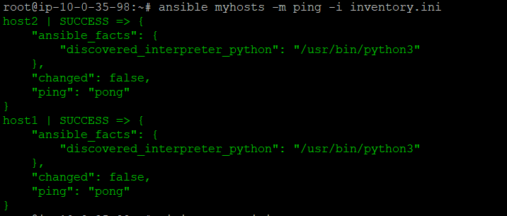
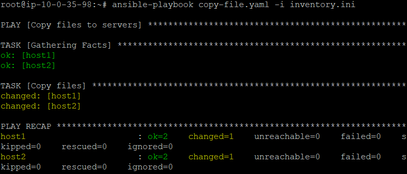
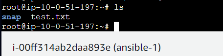

# Ansible Playbook Demo

## From your control node, run the following command to include the official project’s PPA (personal package archive) in your system’s list of sources:

*1. Run the below command* 

     sudo -E apt-add-repository ppa:ansible/ansible

*2. Insytall Ansible* 

    sudo apt update -y
    sudo apt install Ansible -y

*3. Now create two instances in you aws account which we will be using as worker nodes.* 

*4. Inventory file Setup* 

*The inventory file contains information about the hosts you’ll manage with Ansible*
*Create a file by name inventory.ini and store the public ip of all the worker nodes there.*

    sudo nano inventory.ini

 

*5. Create user and add password to the created user using the below commands.* 

    useradd <user-name>
    passwd <user-name>

*6. switch to the created user and generate .ssh keys using the below commands.* 

    su <user-name>
    ssh-keygen -t rsa

*7. Now login to each worker node and perform the same operation - ssh-keygen -t rsa.* 

*8. Now copy the public key from the ansible server using the below command and paste that in .ssh/authorized_keys path of worker nodes.* 

    cat .ssh/id_rsa.pub

    vi .ssh/authorized_keys

*9. Now try to ping the worker nodes from ansible server using the below command.* 

    ansible myhosts -m ping -i inventory.ini

*10. Now lets try to copy a sample file to the worker nodes using ansible.* 

    ansible-playbook copy-file.yaml -i inventory.ini

*No files in server1:* 

*similarly in server2:* 

*files copied successfully:*

