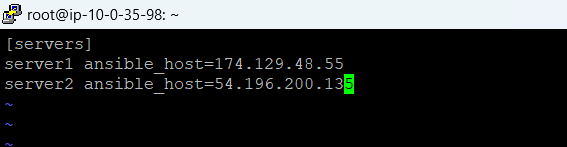

# Ansible Playbook Demo

## From your control node, run the following command to include the official project’s PPA (personal package archive) in your system’s list of sources:

*1. Run the below command* 

     sudo -E apt-add-repository ppa:ansible/ansible

*2. Insytall Ansible* 

    sudo apt update -y
    sudo apt install Ansible -y

*3. Inventory file Setup* 

*The inventory file contains information about the hosts you’ll manage with Ansible*
*To edit the contents of your default Ansible inventory, open the /etc/ansible/hosts file using your text editor of choice, on your Ansible control node:*

    sudo nano /etc/ansible/hosts

